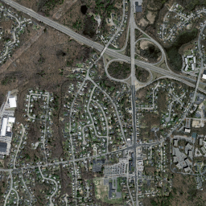
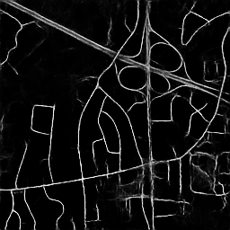

# Roads-Segmentation-Mnih-Dataset (Satellite Images)
Deep learning based scripts which, given an aerial image can output a binary mask for the input image showing for each pixel if it belongs to a road or not. Approach is based on Massachusetts Roads Dataset (Mnih) containing total 1438 high resolution images along with their road masks.

# Problem Statement

In remote sensing analysis, automatic extraction of road network from satellite or aerial images can be a most needed approach for efficient road database creation, refinement, and updating. Given an aerial image, it is required to output a binary mask for the input image showing for each pixel if it belongs to a road or not

# Dataset
Dataset is publicly released for research purposes at [1] but, there is no option available for downloading the data as a whole. One has to go to each image and download
the aerial images. I wrote a Python scraper to download training, testing and validation data from the website.

# Applications/Project Promise

The project falls into the domain of rapidly evolving field of remote sensing (Image segmentation) and its potential applications include road navigation, urban planning etc.

# Methodologies

## 1
A per-pixel-classification technique is used to build the output binary mask, that is, each pixel is independently classified as a part of a road or not.

To classify pixel (x, y), the pixels contained in the surrounding window of a predefined side length 'L' centered at (x, y) will be used as features, so that the input features vector will contain the (r, g, b) values of all these pixels (including the current target pixel at (x, y)), which makes the features vector size = **3xLxL**.

As a classifier, a deep neural network of multiple hidden layers is used. The output layer consists of two neurons representing the two output classes in one-hot vector representation.

For per-pixel technique, we used Tensorflow for a DNN with 4 hidden layers of sizes **100, 150, 100, 50**

## 2

For second method, we used U-Net model with Keras which is encoder-decoder type network where feature maps from convolution part in down sampling step are fed to the up-convolution part in up-sampling step

**Note** The above image is just a generalized U-Net architecture. As our dataset had dimension 1500 * 1500 and after resizing to 256 * 256, this architecture had respective layers and filters.

# Training

The model U-Net was trained for 30 epochs on colab GPU. After 30 epochs, the model training accuracy was about 97% and validation accuracy was about 97% 

# Results

Input           |  Output
:-------------------------:|:-------------------------:
  |  

# References
- [1] https://www.cs.toronto.edu/~vmnih/data/
- [2] Ronneberger, Olaf, Philipp Fischer, and Thomas Brox. "U-net: Convolutional networks for biomedical image segmentation." In International Conference on Medical image computing and computer-assisted intervention, pp. 234-241. Springer, Cham, 2015.
- [3] https://github.com/mahmoudmohsen213/airs
- [4] https://github.com/ArkaJU/U-Net-Satellite
